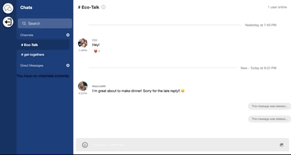

# Chat App

A responsive chat application that mimics chat services such as Slack or Microsoft Teams. Enabling users to create groups and have individual chats. With the help of [Streams API](https://getstream.io/) not only does it help scale the application, but users can reply to messages in a thread, react with emojis to messages, and send both gifs and pictures directly with ease. Also used [Twilio](https://www.twilio.com/) to be able to receive text message notifications if a user is not online!

## Available Scripts

In the project directory, you can run:

### `npm install`

- To install dependencies

### `npm run dev`

- To run the application, which will use [Nodemon](https://www.npmjs.com/package/nodemon)

## The Frontend

Link - [Client](https://github.com/Johnnie71/RM-Client)

The page will reload if you make edits.\
You will also see any lint errors in the console.

## Technologies Used

- Node.js
- React.js
- Stream API
- Twilio

## Keys

Now all of my keys are secret of course so you will have to sign up for a "free trial" for both [Twilio](https://www.twilio.com/) and [Stream](https://getstream.io/).

Create a .env file for your variables and create theses and apply the keys given to you by each account. I have named them for ease!

- STREAM_API_ID=
- STREAM_API_KEY=
- STREAM_API_SECRET=

- TWILIO_ACCOUNT_SID=
- TWILIO_AUTH_TOKEN=
- TWILIO_MESSAGING_SERVICE_SID=
